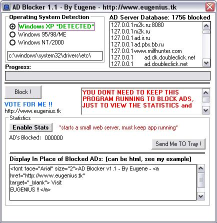



## AD Blocker v1\.1 \- Block ADs BEFore they are even DOWNLOADED \- NEW Features \!\!

### Description

STOP ADs before they are even downloaded, this is the new and improved version, because of the feedback in v1.0 I made some neat changes. This time it will count how many ADs have been blocked, it will also AUTODETECT your OS (well find where the HOST FILE IS anyways), also the COOLER feature is IT CAN REPLACE ALL THE ADs on a WEBSITE with your CUSTOM HTML !!! Plus it can MINIMIZE into SYSTEM TRAY, a MUST LOOK !! JUST LOOK AT THE SCREN SHOT, TEST IT OUT, AND VOTE FOR ME !!!!!
 
### More Info
 

             |
---                |---
**Submitted On**   |2002-11-25 16:10:24
**By**             |[Eugene P\.](https://github.com/Planet-Source-Code/PSCIndex/blob/master/ByAuthor/eugene-p.md)
**Level**          |Beginner
**User Rating**    |4.9 (39 globes from 8 users)
**Compatibility**  |VB 5\.0, VB 6\.0
**Category**       |[Internet/ HTML](https://github.com/Planet-Source-Code/PSCIndex/blob/master/ByCategory/internet-html__1-34.md)
**World**          |[Visual Basic](https://github.com/Planet-Source-Code/PSCIndex/blob/master/ByWorld/visual-basic.md)
**Archive File**   |[AD\_Blocker15034211252002\.zip](https://github.com/Planet-Source-Code/eugene-p-ad-blocker-v1-1-block-ads-before-they-are-even-downloaded-new-features__1-41044/archive/master.zip)

